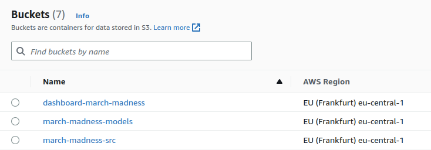
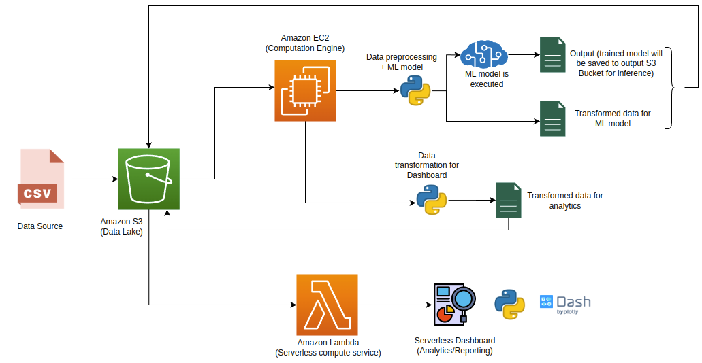

# Data Warehouse Project: March Madness Analytics Documentation
##### 
This repository contains source code for our ELT pipeline based on AWS. AWS S3 is used as data lake, there are 3 separated buckets serving: 
- Source data
- ML models and required data for ML model
- Dashboard data and dashboard content



The whole architecture is as followed



### 1. Main Components
#### AWS Components
- S3: used as data lake
- Sagemaker: it is a fully managed Machine Learning service, which make it easier to build, train, and deploy ML model. We use it to build, train and deploy ML model to predict the winning probability of each basketball team. The result of probabilities will be shown on dashboard
- Lambda: is AWS's function work as a service (FaaS) platform. We deploy our dashboard (a web application) serverless as an AWS Lambda function. The AWS Lambda function only runs when it is requested, and it could be scaled down or up based on demand. 

#### Other components
- Zappa: is a Python serverless microframework for AWS Lambda and API Gateway. It allows us to build, deploy, and manage serverless applications. We use it to deploy and manage our dashboard on AWS Lambda.
- Dash + Plotly: Dash is a Python framework for building web-based analytical applications. It allows us to build interactive and responsive web applications using Python code. We use Dash server to build our dashboard as an wsgi application. Our charts are created with Plotly (a library provides interactive chart creation ability).

### 2. Project Structure
```
march_madness
│   README.md
│   requirements.txt
|   zappa_settings.json
|   app.py
│
└───data_transformation
│   │   ......py
│   
│   
└───prediction
    │   .....py
    │   .....py
```

- `requirements.txt`: contains required libraries
- `zappa_settings.json`: contains zappa config for dashbpard deployment on AWS Lambda
- `app.py`: main Dash app for dashboard, contains source code for creating charts
- `data_transformation`: folder contains source code to transform source data into data needed for dashboard
- `prediction`: folder contains source code for ML model

### 3. Install and Setup

#### Setup environment:

- Clone repository: `git clone https://github.com/haanh764/march_madness.git`
- Create new conda environment: `conda create -n march-madness python=3.9.15`
- Activate `march-madness` environment: `conda activate march-madness`
- Change to project directory and install the `requirements.txt`: `cd march_madness/` && `pip install -r requirements.txt`
- Export env path to virtual env path: `export VIRTUAL_ENV=/opt/conda/envs/march-madness` (the path depends on your computer, you can check it py using `which python`)

#### Setup AWS:
- Signup for AWS account and create AWS Access Keys (`access key id` and `secret access key`). Keep the created keys in `credentials` file, under `/home/.aws` folder (for Linux). The format of `credentials` file is as below (change `default` to your profile name)
```
[default]
aws_access_key_id = ************************
aws_secret_access_key = ************************
```
- Create groups for dashboard and for sagemaker
- For each group create and assign inliine policy to it. For the custom policy of dashboard, add the policy to create, invoke, and execute Lambda function. The sample of custom policy for it is as below (the `***************` is the AWS account number):
```
{
    "Version": "2012-10-17",
    "Statement": [
        {
            "Sid": "VisualEditor0",
            "Effect": "Allow",
            "Action": [
                "iam:GetRole",
                "iam:PassRole",
                "iam:CreateRole",
                "iam:AttachRolePolicy",
                "iam:PutRolePolicy"
            ],
            "Resource": "arn:aws:iam::***************:role/*-ZappaLambdaExecutionRole"
        },
        {
            "Sid": "VisualEditor1",
            "Effect": "Allow",
            "Action": [
                "lambda:CreateFunction",
                "lambda:ListVersionsByFunction",
                "logs:DescribeLogStreams",
                "events:PutRule",
                "s3:CreateBucket",
                "cloudformation:DescribeStackResource",
                "s3:ListBucket",
                "lambda:GetFunctionConfiguration",
                "apigateway:DELETE",
                "events:ListRuleNamesByTarget",
                "s3:AbortMultipartUpload",
                "apigateway:PATCH",
                "events:ListRules",
                "cloudformation:UpdateStack",
                "events:RemoveTargets",
                "lambda:DeleteFunction",
                "cloudfront:UpdateDistribution",
                "logs:FilterLogEvents",
                "s3:DeleteObject",
                "apigateway:GET",
                "lambda:GetAlias",
                "events:ListTargetsByRule",
                "cloudformation:ListStackResources",
                "events:DescribeRule",
                "s3:ListBucketMultipartUploads",
                "apigateway:PUT",
                "logs:DeleteLogGroup",
                "lambda:InvokeFunction",
                "lambda:GetFunction",
                "route53:ListHostedZones",
                "lambda:UpdateFunctionConfiguration",
                "s3:ListMultipartUploadParts",
                "cloudformation:DescribeStacks",
                "events:DeleteRule",
                "events:PutTargets",
                "s3:PutObject",
                "s3:GetObject",
                "lambda:UpdateFunctionCode",
                "lambda:AddPermission",
                "cloudformation:CreateStack",
                "cloudformation:DeleteStack",
                "apigateway:POST",
                "lambda:DeleteFunctionConcurrency",
                "lambda:RemovePermission",
                "lambda:GetPolicy"
            ],
            "Resource": "*"
        }
    ]
}
```
- Create user and attach user to the created group, this user will have the permission rules applied on dashboard application
- Copy the attached user's keys to the `credentials` file as describe above.

#### Setup Zappa
- The setup for Zappa settings could be done by editing file `zappa_settings.json`. You can generate a new setting file by running command `zappa init` (remember to activate the virtual environment `venv` where zappa is installed first). Edit the `"profile_name": "default"` to the profile name corresponding to profile name was specified in `/.aws/credentials`
- Change the `"aws_region"` to corresponding aws regions, also define `s3_bucket` as the bucket that will be used for keeping the dashboard content.
- The format of `zappa_settings.json` is as below:
```
{
    "dev": {
        "app_function": "app.app",
        "profile_name": "default",
        "project_name": "march-madness",
        "runtime": "python3.9",
        "s3_bucket": "dashboard-march-madness",
        "aws_region": "eu-central-1",
        "environment_variables": {"DASH_REQUESTS_PATHNAME_PREFIX": "/dev/"}
    }
}
```

#### Deploy Dashboard
- To deploy the dashboard, run command `zappa deploy dev`
- Or, after make change in the dashboard, to re-deploy the dashboard, run the command `zappa update dev`
- Check this link to see the update dashboard: `https://z8eqecfs2f.execute-api.eu-central-1.amazonaws.com/dev`


### 4. Data Transformation
--- To be filled ----

### 5. Dashboard
--- To be filled ----

### 6. Machine Learning model

#### Creating model
To create a new model, it is necessary to run train.py script located in ml folder. Note that running this script requires providing credentials for boto3 connection. The script will fetch result files from march-madness-src bucket and divide the data so that all years before 2006 are used just as data aggregation about teams the last four years are for validation and testing. Note that the code is by default run on a GPU and will fail if no GPU instance exists. Running this code will generate a model checkpoint, a scaler that should be used for new data, as well as a new file that contains data aggregated about all matches the model had access to so far that needs to be used for predictions on any new matches. The script will also automatically generate predictions for the matches in the test set (last two years). Note that the winning/losing team is anonymized to Team 1 and Team 2 (assigned randomly) in the new file.

#### Making predcitions on new data
To make a prediction for a match that did not happen yet, you can use predict_match function located in handle_new_data script. The function needs s3_client, team IDs, season, day, city ID, and location which is a letter that stays whether this game is a home advantage for team provided as team 1, as well as access to the data stored in the march-madness-models bucket. To make predictions on new file with match results, a script named handle_new_data has a function called handle_new_data that takes in a timestamp that was used for creating files with new results. Running this file will load the model, create predictions and update the data aggregation used for predictions. Note that this process may be slow as all predictions try to use as much match results as possible while not seeing the future, so it runs sequentially. 

#### Changing the model
All the model parameters, including training ones can be accessed in the model.py script. Note that any changes to the model require creating a new model from scratch.